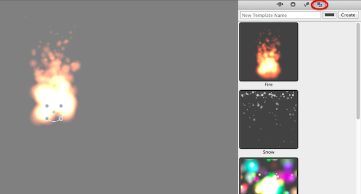
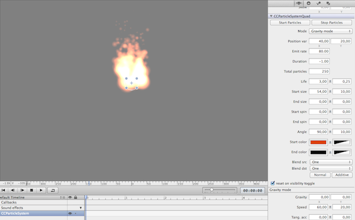

#Particle Effects

A particle effect is used to simulate systems which contain a large number of small bodies that act under similar properties to create a larger effect.  Instead of forcing the programmer to handle each of these particles individually, that work is assigned to a particle generator, and the programmer can define the higher level properties that influence the particles without worrying about the individual particles.  

For example, if you wanted to simulate a snow storm, instead of having to program the progress of each snowflake by hand, you can simply set the general properties for the particles to follow, and using a snowflake image the particle generator will do the rest of the work.  Particle effects can be quite draining on system resources, so it is important to use them wisely

SpriteBuilder provides an integrated particle effect editor. It provides many template particle effects and easily allows to customize them. Cocos2D also supports particle effects created by the third party tool *Particle Designer*.

##Creating Particle Effects in SpriteBuilder
Particle effects are generated by a Cocos2D class known as a CCParticleSystem.  SpriteBuilder allows you to edit all of the properties of the CCParticle system class within the properties window.  It is best practice to nest your particle system within a CCB file so that it can be easily instanciated and referenced in code.  However, if there are special reasons you need to have the CCParticleSystem directly on the scene, you can simply drag and drop it from the node library.

When the particlesCCB file is created it automatically places a CCParticleSystem on the screen.

##Particle Effect Library

The last tab in the right pane reveals the Particle Effect library that provides predefined templates. A template can be selected by double clicking on it.

When a template is selected, the particle is assigned the properties saved in that template.  You can then build on and alter the template using the particle editor.

If you alter a template, or create a new particle effect from scratch and want to save it as atemplate for the future.  With the particle effect selected provide a name and background color for the thumbnale and click the *Create* button.  
    
Templates cannot be directly updated.  If you want to update a template, assign it to a particle, delete the template, make the appropriate changes to the particle and then create a new template with the same name as the one you deleted.

##Using the Particle Editor

Once a particle effect is created and selected the right inspector pane provides all the different options to change particle effect behaviour:

The first set of properties controls properties that affect the entire particle generator

-Start/Stop Particles:  These buttons can turn on/off the particle simulation in the editor so that you can focus on other aspects of the scene, or restart particles that have a long delay between emissions or only play once.

-Mode:  Determines whether the emitted particles follow a path determined by gravity or a radial pattern.  The settings for these different modes can be altered at the bottom of the properties panel

-Position var: Stands for position variance.  This is the number of pixels to either side of the CCParticleSystem's positioned location that particels can be generated in.  The particles will be randomly distributed over the area specified by this variable.  For instance, a particle system positioned at (0,0) with variances x: 50  and y: 50 could generate particles anywhere in the box bounded by (-50,-50), (-50,50), (50,50), (50,-50).

-Emit Rate:  The number of particles emitted each second.

-Duration:   The length of time for which the particle generator should be on.  To have a particle generate particles indefinitly set this value to -1.

-Total particles:  The total number of particles that will be allowed on screen at any one time.  This number, combined with the emit rate and particle life determines whether the particle generator will continually generate particles, or if it will stop after a time and only produce particles in bursts as old particles die off.

The next set of properties control how individual particles are generated.  The box on the left sets the centeral value for generation, while the box on the right sets the range of variance from the centeral value.  The particle generator will automatically generate particles with propreties that fall within this range, adding a dynamic layer to the generator, making it appear more natural

-Life:  The length of time that the particle exists in seconds.

-Start size:  The size of each particle when generated in pts.  Note that this is to the edge of the provided texture, not the visible portion of the texture.

-End size:  The size of each particle when it dies in pts.  Note that this is to the edge of the provided texture, not the visible portion of the texture.

-Start spin: The rotation of the texture when generated in degrees.

-End spin:  The rotation of the texture when it dies in degrees.  If end spin is greater than start spin the image will rotate clockwise, if end spin is less than start spin it will rotate counter-clockwise.

-Angle:  The direction in which each particle is emited.  In gravity mode standard axis conventions are followed (0 degrees is along the positive x axis, 90 degrees is along the positive y axis).  In radius mode 0 degrees is along the negative x axis, but increasing angles still travel counter clockwise.

###########
##########
-Start color:

-End color

The Blend src and Blend dst properties
###########
###########

###Gravity mode
-Gravity x,y: Specifies the gravitational force along each axis using standard axis conventions.  

-Speed:  The initial speed of the particle when generated.

-Tang. acc:  Tangential Accelleration.  The particles accelleration in the direction perpendicular to the original particle stream.

-Radial Acceleration: Rather than a single source of gravity, radial acceleration will accelerate a particle away from the particle emitter along the line that runs between the two.  If position variance and speed are set to 0, no acceleration will be applied since radial forces are being applied equally in every direction.

Radial mode

-Start Radius:  The distance away from the particle generator at which the particles are created.  The location at this distance is specified by the particle generator's angle property.

-End Radius:  The distance away from the particle generator at which the particle will die.  The particle travels with a uniform speed between the start and end radius.

-Rotate:  The number of degrees the particle should travel over its lifespan.  Following standard practice positive degrees create counter-clockwise rotaition, and negative degrees create clockwise rotation.

Particle Texture
This is where you set the image that the particle generator uses as the base for every particle.  For more information about creating your own particle textures, see below.

##Textures for Particle Effects
When creating particle effects from scratch instead of using a template a developer needs to provide a custom texture. The texture provided should represent one single particle in front of a transparent background, the texture is replicated by the particle system as needed. Example for a particle effect texture:

##Adding Particle Effects to a scene
Particle effects can be added to a scene in SpriteBuilder or can be loaded in code and added to a scene dynamically at runtime.

###Adding Particle Effects at runtime in Code
Particle effects can be loaded just as any other CCB file, using the `CCBReader`. A brief example:

	// load particle effect and cast CCNode to CCParticleSystem
	CCParticleSystem *fire = (CCParticleSystem *)[CCBReader load:@"Fire"];
	// make the particle effect clean itself up, once it is completed
	fire.autoRemoveOnFinish = TRUE;
	// place the particle effect on the seals position
	fire.position = ccp(100,100);
	// add the particle effect to the scene
	[self addChild:fire];

##See Also

- [Clone Angry Birds with SpriteBuilder: Add particle effects](https://www.makegameswith.us/tutorials/getting-started-with-spritebuilder/particle-effect/)
