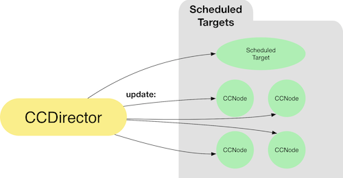

#Cocos2D update loop

Cocos2D provides an update loop that can be used from any `CCNode` subclass.
Cocos2D supports two different update methods that are called by the update loop:

- `update:(CCTime)delta` - update method with a dynamic time step. This method is called directly before a frame gets rendered. Cocos2D tries to render up to 60 frames a second. If the app consumes too much CPU time the framerate might decrease and this method may be called less often then 60 times a second. The `delta` parameter contains the miliseconds since the `update:` method was called last. 
- `fixedUpdate:(CCTime)delta` - update method that is **guaranteed** to be called at the specified interval, e.g. 60 times a second. It is recommended to use this method when changing properties of physics objects. The integrated physics engine operates on this fixed time step. In most cases, using the `fixedUpdate` method to update physical properties will lead to a more accurate physics simulation (as opposed to using the `update` method).

