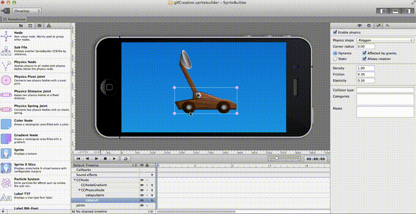
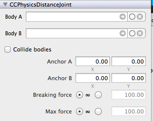
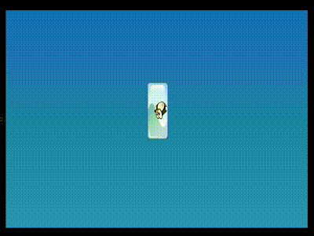
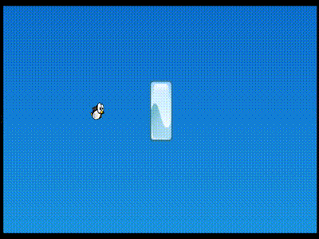

#Joints

Joints are used to connect physics bodies with each other.  SpriteBuilder 1.1 introduces the ability to create joints visually.

##Initializing Joints

SpriteBuilder has three types of joints available in the Node Library:
- `Physics Pivot Joints:` This joint provides a point at which two bodies connect and around which they can pivot
- `Physics Distance Joint:` Links two bodies together and keeps them at a fixed distance
- `Physics Spring Joint:` Links two bodies together elastically

To make a connection between two bodies simply drag the appropriate node from the node library onto the stage.  Next, connect the bodies to the joint by clicking on one of the two circles below the joint and dragging a connection between it and the body on the stage.

Note: In order to make a connection between two bodies they must both be the child of a CCPhysicsNode and they must both have physics enabled.

Joints can also be initialized in code:
- `connectedPivotJointWithBodyA:bodyB:anchorA:`
- `connectedDistanceJointWithBodyA:bodyB:anchorA:anchorB:`
- `connectedDistanceJointWithBodyA:bodyB:anchorA:anchorB:minDistance:maxDistance:`
- `connectedSpringJointWithBodyA:bodyB:anchorA:anchorB:restLength:stiffness:damping:`

Joints can be deactivated by calling the `invalidate` method.

##Properties of All Joints:

Although each joint type is used under different circumstances, there are certain properties that they all have in common.

- `Body A & Body B:`  Specify the elements that the joint links together.  These fields are automatically filled in when connections are made as shown in initializing joints.  Clicking the X will detach the joint from that body.

- `Collide bodies:` If this box is checked the connected bodies will not be able to pass through each other

- `Anchor A & Anchor B:` Specify the coordinates on the physics bodies at which the joint is connected.  Moving the joint on screen will update these fields automatically.  If one of the bodies is static and the other is dynamic, the static body should be attached as body A, and the dynamic body should be body B.

- `Breaking Force:` It is possible to specify a force under the stress of which a joint will “break” allowing the two physics bodies to separate.  By default this is set to infinity so the joint will never break.

- `Maximum Force:`  This sets the maximum “push back” that the joint will provide.  Unlike the breaking force, the joint will still exist if this force is exceeded, however it will bend or deform appropriately.

##Pivot Joint Properties

The pivot joint has three properties that can be enabled: Spring, Limit and Motor.  Angles are defined in terms of body A, so be sure that if you have a static body it is connected to the joint as point A or else the rest angle and degree limits will not be defined the way they are displayed on screen.

- `Spring:` When the spring is enabled body B will be pulled towards the rest angle with force relative to the stiffness of the spring.

- `Limit:`  When limits are enabled, the range of motion of body B around body A will be limited to within those bounds.

> Note: When you have both Spring and Limit enabled a selection bar appears on screen to switch display of circles indicating range etc

- `Motor:`  When enabled the motor will propel body B around the joint  with a given rate.  The arrow on screen indicates the direction that the motor will propel the rotation.  A positive rate rotates the motor counter-clockwise, while a negative rate generates clockwise motion.

##Distance Joint Properties

- `Minimum and Maximum distance:` Enabling these fields will allow the two bodies to have a range of motion along the joint’s axis.  When enabled these distances will be displayed on the bar and can be edited either in the preview window or the properties panel.

##Spring Joint Properties

- `Rest length:`  By default the rest length is set to be the starting length of the spring as displayed on screen.  If rest length is enabled it is possible to make the initial length of the spring different from the rest length of the spring, resulting in the bodies being pulled together if the rest length is shorter than the initial length, and pushed apart if the rest length is longer than the initial length.

- `Damping:`   Specifies the amount of energy lost as the spring undulates.

- `Stiffness:`  Specifies the strength of the spring.  A high stiffness will result in a high resistance against motion and a lot of force when a spring is released.