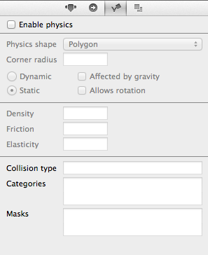

#Physics in SpriteBuilder

Cocos2D uses the powerful Chipmunk2D engine to handle the interactions of physics body.  With SpriteBuilder, you .  Using simple drag and drop tools you can create physics bodies with a wide range of properties, attach bodies together using joints, and even make entire physics simulations by linking together animations and physics bodies, all without having to write a single line of code. 

Since every visual node has the ability to be a physics object, the third tab of the properties panel is entirely devoted to physics properties.  By selecting the enable physics box the node gains full access to all of the physics properties built into Chipmunk and Cocos2D.

This section of the documentation will cover the ways SpriteBuilder simplifies constructing the physics based elements of games.  For even more information about working with physics see the section on [physics in code](link) and [this tutorial](link to peeved penguins tutorial) which shows how to build a physics based game.