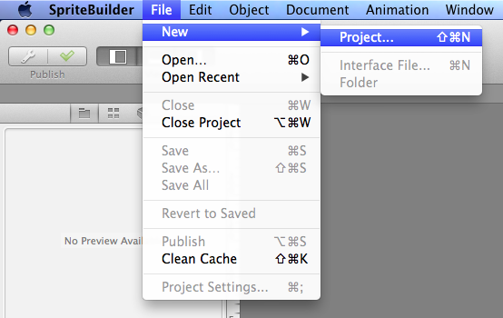

# Create a project in SpriteBuilder

As of Cocos2D 3.2 the recommended way for creating any kind of Cocos2D project is through SpriteBuilder. This will make the Cocos2D update process easier - even for projects that use pure Cocos2D without SpriteBuilder beyond creating a new project.

## Download SpriteBuilder
SpriteBuilder is a tool available on the Mac AppStore. [Download the latest version of SpriteBuilder](https://itunes.apple.com/us/app/spritebuilder/id784912885?mt=12#). SpriteBuilder contains the latest version of Cocos2D. If you create new projects with SpriteBuilder you do not need to download Cocos2D separately.

## Setup new project

Create a new project by opening SpriteBuilder and selecting *File > New > Project...*

Choose a name for your new project. Choose a name for your new project. After you create the project the folder structure should look similar to this:

SpriteBuilder created a new folder (*Projectname*.spritebuilder). Inside that folder SpriteBuilder created a new Xcode project (*Projectname*.xcodeproj).
You can now edit your game in SpriteBuilder and in the corresponding Xcode project.

## Opening a SpriteBuilder project

When you want to open a SpriteBuilder project you need open SpriteBuilder and select the root folder of your project: *Projectname*.spritebuilder.

##See Also

- If you want to learn how to create a complete game in SpriteBuilder read the [Clone Angry Birds with SpriteBuilder](https://www.makegameswith.us/tutorials/getting-started-with-spritebuilder/) tutorial.