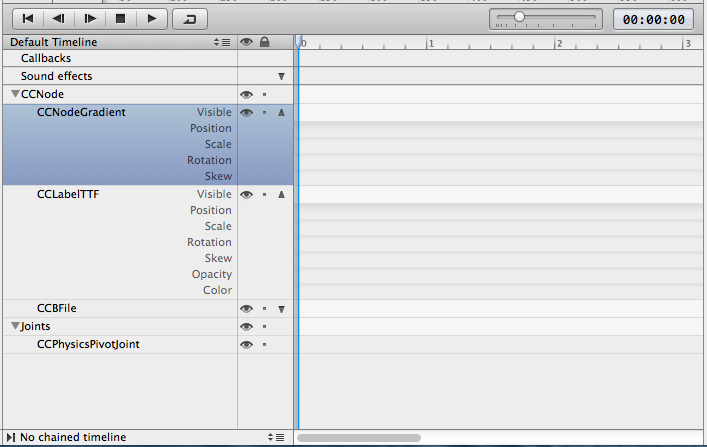

#Creating Animations
The bottom window of the SpriteBuilder interface is the timeline editor, a tool which can be used to create animations. Every ccb file has its own internal timelines, and each node has a number of properties that can be altered over time to create the animations.  A single CCB file can have multiple timelines to animate different aspects of a sprite such as walking, running, jumping.  Timelines can also be chained together so that when one animation finishes another one begins by default.  This section will explore the various properties that can be used and edited on the timeline.

#Interacting with the Timeline

When interacting with nodes on the timeline there are a number of options which can be selected.  The first, an eye, is the visibility of the node.  Selecting the eye will toggle visibility, allowing you to focus on the relevant aspects on screen.  The second, a box,  toggles the lock of an element so that while you are moving or altering other portions of the screen you can be sure you don't accidentally alter that node.  The third, an arrow, expands the node when clicked, so that the user can see and interact with the various properties of the node.  
At the top left of the timeline are controls for handeling animation playback.  At the top right is a slider for adjusting timeline zoom.  Finally, the blue indicator at the top of the timeline can be manually dragged along the timeline in order to view the animation manually, or to select a new location on the timeline.