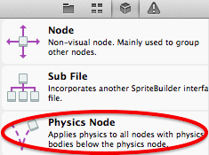
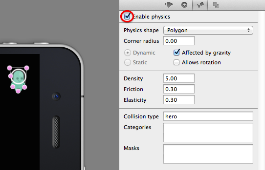

#Setup physics in SpriteBuilder

Basic physics properties can be easily applied within SpriteBuilder. A later chapter will also discuss how to create physics joints in SpriteBuilder.

##Adding a Physics Node

A physics node needs to be added as a parent for any physics object. In SpriteBuilder a physics node can be added directly from the node library:

##Setting up Physics Bodies

In SpriteBuilder any selected Node can be turned into a physics body:

The shape of a physics body can be changed by dragging multiple points from the outline of the object. The physics body shape can either be a polygon or a circle. As of SpriteBuilder 3.1 it is also possible to create concave shapes for physics bodies.

The third tab in the inspector pane on the right reveals all physics properties that can be manipulated in SpriteBuilder. As of SpriteBuilder 3.1 that includes Collision Type, Categories and Masks. This means it is not necessary to setup a custom class for a node with activated physics just to set a collision type or collision masks.