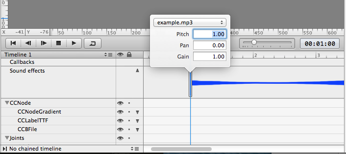

#Adding Audio to the Timeline
Audio can be added to the timeline directly on top of animations, allowing you to syncronize soud effects or music with the motion of your sprites.  Audio can either be dragged directly onto the timeline from the library, or an audio event can be created by option-clicking on the timeline, and then selecting the audio source in the event's pop-up box.

Note:  Once a sound file is triggered it will play through to the end.  This means that if your sound file is longer than your animation timeline and you have your timeline set to loop the sound will trigger for a second time before the first sound finishes.

Audio File Options:
Pitch - Increase or decrease the pitch of your audio file.  1.0 is the default pitch, and increasing the value increases the pitch while decreasing the value decraeses the pitch.  Note that this is done by slowing the audio file down or speeding it up by the appropriate percentage, so if you would like to change the pitch of the audio file but keep it the same speed/duration you will need to use an external audio editing program.  

Pan - 

Gain - The Gain is a way of adjusting the audio level for a sound effect reletiv to other sound effects in the game.

