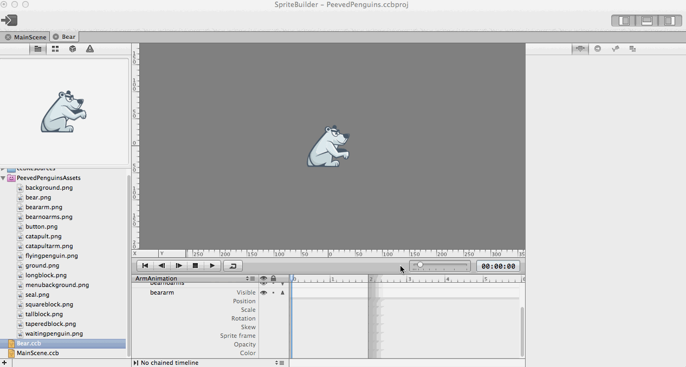
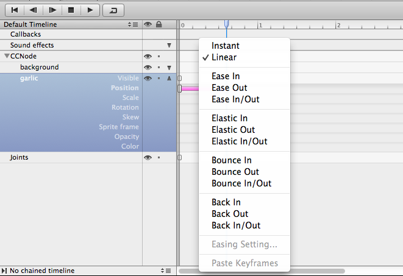

#SpriteBuilder's Timeline

SpriteBuilder's timeline provides a visual tool for creating keyframe based animations.
The different key frame types are:

- Visibility
- Position
- Scale 
- Rotation
- Skew
- Sprite Frame (only applicable to *CCSprite*)
- Opacity
- Color

[Our tutorial on animating a character with SpriteBuilder's timeline covers all of the most important timeline features](https://www.makegameswith.us/tutorials/getting-started-with-spritebuilder/animating-spritebuilder/).

##Running timeline animations from code
Using SpriteBuilder you can create multiple timelines for multiple animations. You can start any of these timelines from code using the `CCAnimationManager`. Each root node in a CCB file has access to a `CCAnimationManager` instance through the `userObject` property. Animations can be run using the `runAnimationsForSequenceNamed:` method of `CCAnimationManager`. A brief example:

	// the animation manager of each node is stored in the 'userObject' property
    CCAnimationManager* animationManager = self.animationManager;
    // timelines can be referenced and run by name
    [animationManager runAnimationsForSequenceNamed:@"Jump"];
    
##Listening for completed animations
The `CCAnimationManager` provides two ways to get informed about animations that completed.

- using the `setCompletedAnimationCallbackBlock:` method. This way the provided block will be exectued for every completed timeline animation. To check the name of the timeline animation that just completed a develeoper can use the `lastCompletedSequenceName` method.
- implementing the `CCAnimationManagerDelegate` protocol and setting a class up as the delegate of the `CCAnimationManager`. This way the `CCAnimationManager` will call `completedAnimationSequenceNamed:` for each completed timeline animation.

##Setting up code callbacks in the timeline
By using the Option-Key and clicking into the *Callback* section of the timeline a developer can define a method that shall be called as part of a timeline animation on the *Document Root* or *Owner* of the root node of the current scene:

##Changing animation type of timeline animations
Per default all animations created in the timeline are linear animations. By right clicking onto the pink bar of the animation in the timeline, a developer can choose different types of interpolations, e.g. *Ease In*:

##See Also

- [Clone Angry Birds with SpriteBuilder: Animations with SpriteBuilder's timeline](https://www.makegameswith.us/tutorials/getting-started-with-spritebuilder/animating-spritebuilder/)
- [Clone Angry Birds with SpriteBuilder: Sprite Frame Animations ](https://www.makegameswith.us/tutorials/getting-started-with-spritebuilder/sprite-animation-spritebuilder/)
 
