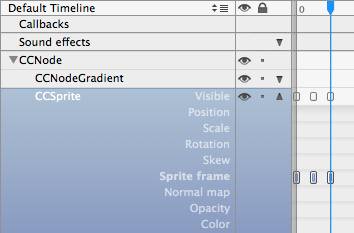

# SpriteFrame Animations

Sprite frame animations refers to the technique of changing a sprite's texture over time, replacing its displayed image with a new one at a fixed interval, thus creating the illusion of a character in motion/action.

This article explains how to run a spriteframe animation via both SpriteBuilder and Cocos2D, as well as explaining some of its pros and cons.

<table border="0"><tr><td width="48px" bgcolor="#d0f0ff"><strong>Info</strong></td><td bgcolor="#d0f0ff">
There are no Swift code samples since CCAnimation is not currently available in Swift.
</td></tr></table>

## Pros and Cons of Sprite Frame Animations

**Pros:**

- Can cycle any image.
- Can play animations in reverse.
- Can setup animations to start with an *intro* animation, run a *loop* animation an indefinite number of times, and end with an *extro* animation.
- Can alter frame display time (delay) as needed, even for the same animation.
- Frame image dimensions needn't be all the same. 
- Texture packing tools efficiently pack and cut off excess transparent areas, can even alias duplicate images to the same file.

**Cons:**

- Frame display time (delay) is fixed for all frames, ie all animation frames stay visible for the same duration. You would have to compensate by creating smaller individual animations with varying delays.
- Varying frame sizes not always suitable, especially where the sprite's contentSize is used for collision detection.
- Memory usage is a multiple of *texture memory usage* times *number of animation frames*. 
- Usually frame interval below 30 fps due to memory concerns. For instance very smooth animations, such as representing each degree in a 360 degree motion with its own image frame, are commonly regarded as wasteful regarding memory consumption so that a compromise is made, ie one frame every 5 degrees.
- Not suitable for full-screen animations due to memory usage and texture dimensions. When keeping only the current and next image in memory, loading the next frame from disk may take longer than the time the frame is supposed to remain visible, thus limiting the achievable framerate of the animation. Consider recording a video in a streaming format such as QuickTime (MP4).

## Creating SpriteFrame Animations in SpriteBuilder

Creating SpriteFrame Animations is very simple in SpriteBuilder:

- Import the animation images into SpriteBuilder (see [SpriteBuilder: Resource Files](./spritebuilder/resource-files)).
- Open the stage and select the sprite you want to animate.
- Select all the animation images in the File View.
- Right-click and select *Create Keyframes from Selection* to add the spriteframe keyframes to the selected sprite.

You'll see a corresponding number of keyframes have been added to the selected sprite, all equally spaced. If you want to alter the animation's playback speed.

<table border="0"><tr><td width="48px" bgcolor="#d0ffd0"><strong>Tip</strong></td><td bgcolor="#d0ffd0">
If this won't work, double-check that the desired sprite is currently selected when you run the *Create Keyframes from Selection* command and that the selected node is indeed a Sprite node.
</td></tr></table>

## Creating Sprite Frame Animations in Cocos2D

<table border="0"><tr><td width="48px" bgcolor="#ffffc0"><strong>Note</strong></td><td bgcolor="#ffffc0">
The information below is prone to change in a future Cocos2D release.
</td></tr></table>

To create a sprite frame animation in Cocos2D, you need to:

- Add the image resource files to the Xcode project.
- Import the *CCAnimation.h* header file.
- Create a [`CCAnimation`](http://www.cocos2d-swift.org/docs/api/Classes/CCAnimation.html) instance with a list of [`CCSpriteFrame`](http://www.cocos2d-swift.org/docs/api/Classes/CCSpriteFrame.html) instances and the frame delay.
- Run the animation via [`CCActionAnimate`](http://www.cocos2d-swift.org/docs/api/Classes/CCActionAnimate.html).

First of all, you have to import the *CCAnimation.h* header file at the top of your implementation file. You may also need to forward-declare the CCAnimation class in your interface if you make use of that class in the interface. 

<table border="0"><tr><td width="48px" bgcolor="#d0f0ff"><strong>Info</strong></td><td bgcolor="#d0f0ff">
The *CCAnimation.h* header file is no longer public because it will be retired in a future version of Cocos2D (v3.5 or later). You can find an alternative way to run animations in the (also non-public) *CCAnimationManager+FrameAnimation.h+.
</td></tr></table>

### CCAnimation Forward Declaration (optional)

If you need to use the `CCAnimation` class in your interface, for instance to declare a property, use the @class keyword:

	// forward declare the CCAnimation class
	@class CCAnimation;

	@interface MyClass : CCNode
	@property CCAnimation* playerAnim;
	@end

### Import CCAnimation.h

Otherwise just import the header in your implementation file in which you want to use CCAnimation:

	#import "MyClass.h"
	#import "CCAnimation.h" // added for Animation support
	
	@implementation MyClass
	..
	@end

### Create CCAnimation with a list of CCSpriteFrame

The `CCAnimation` is typically initialized with an array containing `CCSpriteFrame` instances, the latter will load the image either from a sprite sheet containing an image frame with that name or, if that fails, from the given path and filename:

    NSArray* frames = @[[CCSpriteFrame frameWithImageNamed:@"SpriteSheets/Global/player-anim1.png"],
                        [CCSpriteFrame frameWithImageNamed:@"SpriteSheets/Global/player-anim2.png"],
                        [CCSpriteFrame frameWithImageNamed:@"SpriteSheets/Global/player-anim3.png"]];
    CCAnimation* animation = [CCAnimation animationWithSpriteFrames:frames
                                                              delay:0.2];

Alternatively you can create an empty `CCAnimation` instance, set its delay and then start adding sprite frames like so:

    CCAnimation* animation = [CCAnimation animation];
    animation.delayPerUnit = 0.2;
    [animation addSpriteFrame:[CCSpriteFrame frameWithImageNamed:@"SpriteSheets/Global/player-anim1.png"]];
    [animation addSpriteFrame:[CCSpriteFrame frameWithImageNamed:@"SpriteSheets/Global/player-anim2.png"]];
    [animation addSpriteFrame:[CCSpriteFrame frameWithImageNamed:@"SpriteSheets/Global/player-anim3.png"]];
    
Either way is fine. You may want to store the animation in an ivar or property, for instance to take the property from above you could assign it like so:

	_playerAnim = animation;

### Run the CCAnimation via CCActionAnimate

Lastly, when you decide you need to play this animation you create a `CCActionAnimate` with the `CCAnimation` instance and run it:

    id anim = [CCActionAnimate actionWithAnimation:_playerAnim];
    [player runAction:anim];
