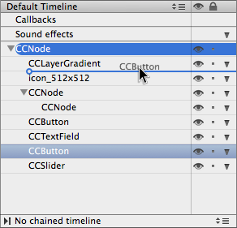

# Working with ccb files

SpriteBuilder structures games in ccb files. CCB files can represent scenes and different kinds of node graphs. CCB files store information about positions and properties of different nodes (including physics properties). Additionally ccb files can store information about animations.

I most cases each scene in a game created with SpriteBuilder is represented by its own ccb file. The default SpriteBuilder project comes with a *MainScene.ccb* that is setup to be the initial ccb file.

## Creating ccb files
A new ccb file can be created by selecting *New > File...* from the *File* menu.

SpriteBuilder supports five different types of ccb-files.

- **Scenes** will fill the full area of the device.
- **Nodes** are logically represented by a single point. Use this type for creating character animations or other game components.
- **Layers** are nodes with a content size. This is useful, for instance, when creating levels or contents for scroll views.
- **Sprites** are sprite nodes. This is useful, for instance, when you want to add a physics body to a single sprite.
- **Particles** are particle systems. Use this option for creating stand alone particle systems.

The type of a ccb file cannot be changed once it has been created (however its content can be copied into a new file).

## Adding Nodes
SpriteBuilder has support for many of Cocos2D node types. To add new nodes to a file, open the *Node Library View*. Each icon in the panel corresponds to a Cocos2D class. Drag the icons into either the canvas of an open document or onto its timeline.

Images can also be added as sprites by dragging them from the *File view* or the *Tileless View* to the stage or to the timeline. CCB files can be added as sub ccb files in the same way.

## Changing zOrder
Unlike other properties, the zOrder is not set in the properties inspector in SpriteBuilder. Instead, the zOrder is determined by the ordering of objects in the hierarchy view in the timeline. All objects you add to a ccb file will show up in the hierarchy view. To arrange them, simply drag and drop them to the position that you require.

When loaded into your app, the zOrder of your nodes will be numbered from 0 to (N-1), where N is the number of children the parent node has. 

## Guides and Sticky Notes
Guides and sticky notes have no effect when loaded into your app but can make it easier to align objects or save comments for other developers or designers working in the ccb-file.

To create a new guide, drag it out from the bottom or left side ruler. To move it, hold down the command key while dragging it. You can remove a guide by dragging it out of the visible area.

Sticky notes are created by choosing *Add Sticky Note* from the *Document* menu. Edit or remove the sticky note by double clicking it.

## Moving Nodes

In general nodes can be selected on the stage and can be dragged to a new position. As of SpriteBuilder 3.1 you can also select multiple nodes at once and move them all together. Hold the *Shift* (⇧) key and select multiple nodes by clicking onto them. Then drag any of the selected nodes and you will see that the nodes move as a group.
