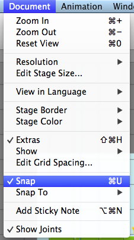
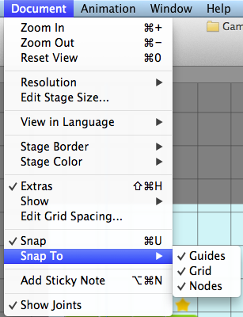

#SpriteBuilder's Grid System

SpriteBuilder 1.1 introduces a new grid & snapping system that makes it a lot easier to arrange large amount of nodes, for example when building levels. Nodes can now snap to grids, guides and other nodes.

##Activating Snapping

By selecting *Document* -> *Snap* snapping for all nodes can be activated and deactivated:

Further a developer can specify with types of snapping should be activated. SpriteBuilder supports snapping to:

- Nodes 
- Grid
- Guides

This option is available through the menu: *Document* -> *Snap To*:

Snapping to the grid can only be activated when the grid is visible.

###Snapping to other nodes
SpriteBuilder uses a special visualization to show a developer that a node is snapping to another node:

For snapping to grids and guides no special visualization is used since both are visual lines already.

##Displaying the Grid

In order to display the grid you need to select the corresponding menu entry. Activate *Document* -> *Show* -> *Grid*:

##Changing the Grid size
SpriteBuilder allows developers to choose an appropriate Grid size for their game. The option is available in the menu: *Document* -> *Edit Grid Spacing*.