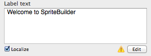
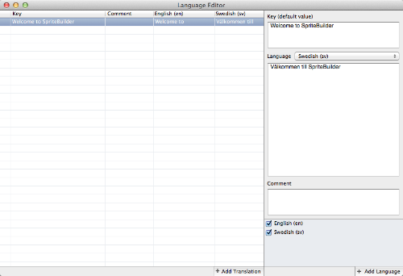

# Localization

SpriteBuilder contains tools that help you create games that support multiple languages. You can edit and preview your translations directly inside SpriteBuilder.

To localize a label or button, check the *Localize* checkbox under the text field in the property editor. A little warning triangle will appear next to the *Edit* button that becomes active. The warning triangle indicates that no translation is available for the text. Click the *Edit* button to open up the language editor.

## The Language Editor
In the language editor you can add languages and translations. To add support for a new language to your project, click the *Add Language* button in the bottom right corner. To add a new translation, click the *Add Translation* button. The translations you add can be used in the code and referenced from inside SpriteBuilder.

If you have the *Localize* button checked for a text field it will use the text in the text field as the key for the translation. Add values in the language editor for each language you are supporting. If no translation is found for a specific key, the key itself will be displayed instead.

You can preview your ccb-file in any of the languages you have added support for by using the *Document > View In Language* menu options.

## Accessing Translations from Code
You can access any translations you add in the translation editor from your code using the *CCBLocalize* function. Simply pass your translation string key to the function.

    NSLog(CCBLocalize(@"Welcome to SpriteBuilder"));