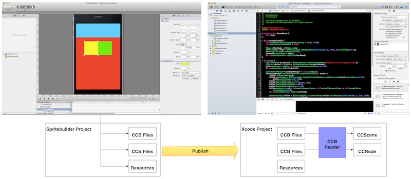

#Getting started with SpriteBuilder

SpriteBuilder is a visual editor that allows you to rapidly create Cocos2D games. It enables developers and artists to create user interfaces, gameplay scenes, levels, advanced animations, particle systems and physics. In addition SpriteBuilder includes tools that will manage your assets, build sprite sheets, help localize your game and handle audio effects.

All of these features enable developers to create great Cocos2D games at a higher pace. 

#SpriteBuilder workflow

When a developer uses SpriteBuilder for a game, he will start by creating a new SpriteBuilder project instead of an Xcode project. When creating a SpriteBuilder project, SpriteBuilder will create and maintain an embedded Xcode project.

Inside the SpriteBuilder project a developer will organize all the resources and assets for the game. He will create interface files for the different scenes in his game. The interface files are called .ccb files, named after SpriteBuilder's predecessor CocosBuilder. SpriteBuilder also supports code connections. With code connections a developer create links between .ccb files and Objective-C classes. This means a developer can add behavior to a game's objects in SpriteBuilder and in code.

In general the workflow with SpriteBuilder will look like this:

* Create a new project in SpriteBuilder
* Add images and other resources to your SpriteBuilder project
* Create multiple .ccb files for the different scenes and objects in your game
* Add code connections to extend the behavior of these scenes and objects
* Publish project in SpriteBuilder. This will update the Xcode project that is linked to the SpriteBuilder project
* Run game from Xcode

When the game is run from Xcode, a component called `CCBReader` will read all the .ccb files from the SpriteBuilder project and create Cocos2D Scenes and Nodes out of them. This is a visualization of how SpriteBuilder and Xcode projects work together:

