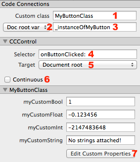

# Code Connections

The Item Code Connections tab enables you to assign a custom class to a node, to assign the node reference to an existing ivar or property in the document root class, to specify selector and target for nodes inheriting from CCControl and to create and edit custom properties.

1. **Custom Class** is the name of an Objective-C class that you've added or intend to add to the Xcode project. <table border="0"><tr><td width="48px" bgcolor="#ffd0d0"><strong>Caution</strong></td><td bgcolor="#ffd0d0">
The custom class must exist in the project and it *must inherit from the node's super class*! A runtime error will occur if it does not. For instance the custom class used by a Sprite node must inherit from CCSprite, the custom class for a Color Node must inherit from CCNodeColor.
</td></tr></table><table border="0"><tr><td width="48px" bgcolor="#d0ffd0"><strong>Tip</strong></td><td bgcolor="#d0ffd0">
You can use the name of the node's class itself, for instance `CCPhysicsNode` if the node is a Physics Node. This would allow you to add Custom Properties which already exist in the class but are not (yet) editable in SpriteBuilder. In this instance you could add the custom properties `debugDraw` (type: `bool`) and `iterations` (type: `int`) to be able to enable/disable debug drawing and to tweak the number of solver iterations from within SpriteBuilder.
</td></tr></table>
1. **Var Assignment Target** defines to which node the variable in the text field on the right should be assigned to. If set to *Doc root var* the current document's root node must have a custom class with a @property or instance variable of the given name. Otherwise a runtime error will occur. <table border="0"><tr><td width="48px" bgcolor="#ffffc0"><strong>Note</strong></td><td bgcolor="#ffffc0">
Unless you explicitly specify an *Owner* reference when calling one of CCBReader's 'load:owner:' methods you have to leave this setting to its default value *Doc root var* for it to have any function. It is not currently possible to [assign the variable to the document's parent document](https://github.com/spritebuilder/SpriteBuilder/issues/418).
</td></tr></table>
1. **Variable Name** is the exact name of either an instance variable (ivar) or @property in the targeted class. The ivar or property must be of type `id` or `CCNode*` or a pointer to the node's super or custom class, in this instance both `CCButton*` and `MyButtonClass*` would be legal. <table border="0"><tr><td width="48px" bgcolor="#d0ffd0"><strong>Tip</strong></td><td bgcolor="#d0ffd0">
If you have an auto-synthesized @property and you want to assign the variable directly to the ivar rather than going through the property just prefix the variable with a leading underscore, [as is customary for auto-synthesized instance variables](https://developer.apple.com/library/ios/documentation/Cocoa/Conceptual/ProgrammingWithObjectiveC/EncapsulatingData/EncapsulatingData.html#//apple_ref/doc/uid/TP40011210-CH5-SW6).
</td></tr></table>
4. **Selector** is the name of a selector (method) which will be called when the control is clicked (Button) or changed its value (Slider). The selector must be implemented in the targeted class (here: *Document root* which refers to the custom class *MyButtonClass*). The selector can take no parameters or optionally can be written with a colon at the end. In that case the selector needs to accept a single parameter of type `(CCControl*)sender`. In this case `(CCButton*)sender` would also be legal and more specific, since the node being edited is a Button node.
5. **Selector Target** allows you to change the targeted node for the selector. The default *Document root* assumes the selector is implemented in the custom class of the document's root node. The alternative *Owner* is only valid if you pass an owner object to one of CCBReader's `load:owner:` methods. <table border="0"><tr><td width="48px" bgcolor="#ffffc0"><strong>Note</strong></td><td bgcolor="#ffffc0">
A common mistake is to incorrectly assume that the selector has to be implemented in the custom class of the Button/Slider node (here: *MyButtonClass*).
</td></tr></table>
6. **Continuous** will run the selector continuously. For buttons the selector will be called as long as the button is pressed down. Without Continuous the selector will run only once, when the finger is lifted while it rested on the button. For sliders the Continuous flag will cause the selector to run every time the slider value changes, otherwise the selector will run once after the slider has been adjusted.
7. **Edit Custom Properties** is explained below.

## Edit Custom Properties

...

<table border="0"><tr><td width="48px" bgcolor="#ffa0ff"><strong>TBD</strong></td><td bgcolor="#ffa0ff">
write stuff here
</td></tr></table>