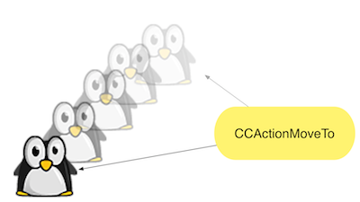

#This is full the test ey

This page is a test. Do not look at it. It will receive you Augenkrebs. Jaaa.

GIF Test

Video Test
360p
<iframe width="640" height="360" src="//www.youtube-nocookie.com/embed/k47Gi8KSJQs?rel=0" frameborder="0" allowfullscreen></iframe>

480p
<iframe width="853" height="480" src="//www.youtube-nocookie.com/embed/k47Gi8KSJQs?rel=0&amp;showinfo=0" frameborder="0" allowfullscreen></iframe>

720p
<iframe width="1280" height="720" src="//www.youtube-nocookie.com/embed/k47Gi8KSJQs?rel=0&amp;showinfo=0" frameborder="1" allowfullscreen></iframe>

# First Heading
Headings can be created either by one or more leading # characters or by underlining the heading with hyphens (h2) or equal signs for H1 (three or more: --- === ).
Heading 1
===
## Heading 2
### Heading 3
#### Heading 4
##### Heading 5
###### Heading 6

### Code
Inline code uses single backtick: `BOOL b = [self getMeSomeBool];`

Multi-line code is printed in a panel with dark background and syntax highlighting by indenting it with one or more tabs:

    -(void) myMethod:(CGFloat)theParameter
    {
        NSLog(@"this does nothing: %f", theParameter);
    }

### Links
Links inlined use the [link text] (url) format with no space between [] and () brackets.
[Google](http://bit.ly/uxMA6H)

Links with link references uses
 [link-id] [] format: [overview][]

Actual links can be filled in at the bottom as: [link-id]: url
 [overview]: http://localhost/~gaminghorror/#!/docs/1.3/overview
 
Links to local pages simply omit the () brackets (the link will point to the latest version of that article):
 [overview]

A raw web link can be included as is by enclosing it in < > angle brackets:
 <https://github.com/fletcher/peg-multimarkdown-latex-support>
 
This is also how you do email links: <mailto:owner@pwning.biz>

Clicking this anchor link should scroll to the top of the page: [First Heading](#anchor1)

### Images

Relative paths do work:
../../1.0/animations-movements/CCAction.png

Image inlined:

Image reference declaration: `[action-image]: ../../1.0/animations-movements/CCAction.png "tooltip2"`

[action-image]: ../../1.0/animations-movements/CCAction.png "tooltip2"

Image by reference:

![**image** caption][action-image]

### HTML

iframe test

<iframe width="640" height="360" src="//www.youtube-nocookie.com/embed/2gLWQIm9qP4?rel=0" frameborder="0" allowfullscreen></iframe>

### Quotes

> This is a quote. It starts with a "greater than" angle bracket: > quote
The quote runs over multiple lines. It is not necessary to prefix every line with a > character.
> > Quotes can be nested.

### Lists

This is a list:

- item1
- item3
    - subitem1
    - subitem2
- item478

And a numbered list:

1. uno
1. dos
1. tres
    2. subnumber1
    2. subnumber2
1. etc

### Tables

First Header | Second Header | Third Header
------------ | ------------- | ------------
Content Cell | Content Cell  | Content Cell
Content Cell | Content Cell  | Content Cell

Specify alignment for each column by adding colons to separator lines:

First Header | Second Header | Third Header
:----------- | :-----------: | -----------:
Left         | Center        | Right
Left         | Center        | Right

### Text

Let 2 spaces at the end of a line to do a  
line break

Text attributes *italic*, **bold**, `monospace`,~~monospace~~, `monospace` .
*Kursiv*, **Fett** und ***Fett kursiv*** bzw.
_Kursiv_, __Fett__ und ___Fett kursiv___	Kursiv, Fett und Fett kursiv bzw.

This --- will add a line:

---

## Things that don't work

- Anchors (#) don't seem to work. 
- Math formulas can't be inlined.
- Snippets, footnotes, glossary don't work.
- Image attributes (except tooltip)
- math formulas
- anchors with full markdown syntax, anchor target needs to be specified as: <a name="anchor"/> or (if the markdown editor is messed up) as: 

## Nice to have

- custom macros expanding to html/markdown (this may be best done by the text editor but markdown editors may not have such functionality)
- a panel with a background (note/tip/caution box)
- importing (inlining) other markdown files
